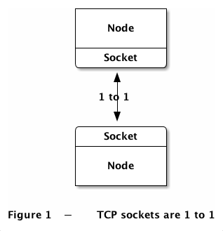
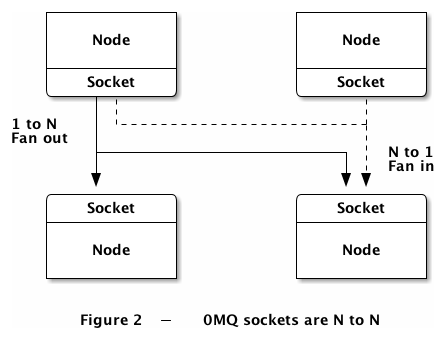
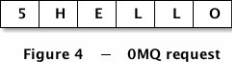

# 进阶篇

`ZMQ`的`socket`的生命周期：

1. 创建和销毁`socket`
2. 配置和读取`socket`选项
3. 为`socket`建立连接
4. 发送和接收消息

## 使用 socket 构建拓扑结构

在两个节点相互连接时，一个使用`bind()`，另一个使用`connect()`。一般来说，使用`bind()`的是服务端，绑定`socket`至端点，地址固定；使用`connect()`为服务端，连接`socket`至端点，地址不固定。端点是指某个广为人知的网络地址。

`ZMQ`连接和传统的`TCP`连接是有区别的，主要有：

- 使用多种协议，`inproc`（进程内）、`ipc`（进程间）、`tcp`、 `pgm`（广播）、`epgm`。
- 当客户端使用`connect()`时连接就已经建立了，并不要求该 端点已有某个服务使用`bind()`进行了绑定。
- 连接是异步的，并由一组消息队列做缓冲。
- 连接会表现出某种消息模式，这是由创建连接的`socket`类型决定的。
- 一个`socket`可以有多个输入和输出连接。
- `ZMQ`没有类似Python原生`socket`中的`accept()`的函数，当`socket`绑定至端 点时它就自动开始接受连接了。

在现在很多架构都是使用了类似于`C/S（client/server）`的架构。相比于服务端，客户端的组件要更加动态。服务端的地址对于客户端来说，往往是可见的，反之则不然。在传统的网络连接中，如果先打开客户端，再打开服务端，那客户端势必会受到系统的报错信息，但是`ZMQ`的机制，却让我们自由的先后启动架构中任意一方的组件。

服务端节点可以仅使用一个`socket`就能绑定至多个端点。也就是说，它能够使用不同的协议来建立连接：

```python
import zmq
context = zmq.Context()
socket = context.socket(zmq.PUB)

socket.bind('tcp://127.0.0.1:5555')
socket.bind('ipc://myserver.ipc')
```

当然，多次绑定同一个地址是不允许的，这样会报错：**`zmq.error.ZMQError: Address in use`**。

每当有客户端节点使用`connect()`连接至上述某个端点时，服务端就会自动创建连接。`ZMQ`没有对连接数量进行限制。此外，客户端节点也可以使用一个`socket`同时建立多个连接。大多数情况下，哪个节点充当服务端，哪个作为客户端，是网络架构层 面的内容，而非消息流问题。不过也有一些特殊情况（如失去连接后的 消息重发），同一种`socket`使用绑定和连接是会有一些不同的行为的。所以说，当在设计架构时，应该遵循**服务端是稳定的，客户端是灵活的**原则，就不太会出错。

`socket`是有类型的，`socket`类型定义了`socket`的行为，它在发送和接收消息时的规则等。将不同种类的`socket`进行连接，如PUB-SUB组 合，这种组合称之为**发布-订阅**模式。

`socket`可以使用不同的方式连接，构建了`ZMQ`最基本的消息队列系统。在此基础之上，我们还可以在建立更为复杂的装置或是路由机制。`ZMQ`提供了一整台组件，可在网络架构中根据需求去组装使用。

## 使用 socket 传递数据

发送和接收消息使用的是`send()`和`recv()`这两个函数。虽然函数名称看起来很直白，但`ZMQ`的`I/O`模式和传统的`TCP`协议有很大不同。

`TCP``socket`和`ZMQ``socket`之间在传输数据方面的区别：

- `ZMQ`的`socket`传输的是消息，而不是字节（TCP）或帧（UDP）。消息指的是一段指定长度的二进制数据块，这种设计是为了性能优化而考虑的。
- `ZMQ`的`socket`在后台进行`I/O`操作，也就是说无论是接收还是发送消息，它都会先传送到一个本地的缓冲队列，这个内存队列的大小是可以配置的。
- `ZMQ`的`socket`可以和多个`socket`进行连接（如果`socket`类型允许的话）。`TCP`协议只能进行点对点的连接，而`ZMQ`则可以进行一对多（类似于无线广播）、多对多（类似于邮局）、多对一（类似于信箱），当然也包括一对一的情况。
- `ZMQ`的`socket`可以发送消息给多个端点（扇出模型），或从多个端点中接收消息（扇入模型）。


 

所以，向`ZMQ`的`socket`写入一个消息时可能会将消息发送给很多节点，相应的，`socket`又会从所有已建立的连接中接收消息。`recv()`方法使用了公平队列的算法来决定接收哪个连接的消息。

调用`send()`方法时其实并没有真正将消息发送给`socket`连接。消息会在一个内存队列中保存下来，并由后台的`I/O`线程异步地进行发送。如果不出意外情况，这一行为是非阻塞的。所以说，即便`send()`有返回值，并不能代表消息已经发送。

## 单播传输

单播（Unicast）是在一个单个的发送者和一个接受者之间通过网络进行的通信。

### 优点：

- 服务器及时响应客户机的请求
- 服务器针对每个客户不同的请求发送不同的数据，容易实现个性化服务。

### 缺点：

- 服务器针对每个客户机发送数据流，$服务器流量=客户机数量×客户机流量$；在客户数量大、每个客户机流量大的流媒体应用中服务器无法支持如此庞大的数据流。
- 现有的网络带宽是金字塔结构，城际省际主干带宽仅仅相当于其所有用户带宽之和的`5%`。如果全部使用单播协议，将造成网络主干不堪重负。

### ZMQ提供了如下单播传输协议：

- tcp：传输控制协议，一般而言我们会使用`tcp`作为传输协议，这种TCP连接是可以脱机运作的，它灵活、便携、且足够快速。所谓脱机，就是`ZMQ`中的`TCP`连接不需要该端点已经有某个服务进行了绑定，客户端和服务端可以随时进行连接和绑定，这对应用程序而言都是透明的。
- inporc：进程内协议，可以在同一个进程的不同线程之间进行消息传输，比`ipc`或`tcp`要快得多。这种协议，必须先绑定到端点才能建立连接。通常的做法是先启动服务端线程，绑定至端点，后启动客户端线程，连接至端点。
- ipc：进程间协议，和`tcp`的行为差不多，但已从网络传输中抽象出来，不需要指定`IP`地址或者域名。

## ZMQ 与 HTTP 请求的简单对比

`ZMQ`不只是一个数据传输的工具，而是在现有通信协议之上建立起来的新架构。它的数据帧和现有的协议并不兼容。

 

HTTP请求使用CR-LF（换行符）作为信息帧的间隔，而ZMQ则使用指定长度来定义帧。

可以确定的是，使用`ZMQ`可以写一个类似于`HTTP`协议的东西，但是这并不是`HTTP`。

## 核心消息模式

`ZMQ`的消息模式是指不同类型`socket`的组合。在很多企业级消息应用中，类似的组合很常见。

`ZMQ`提供的核心消息模式如下：

- 请求 - 应答模式（REQ - REP）：将一组服务端和一组客户端相连，用于远程过程调用或任务分发。
- 发布 - 订阅模式（PUB - SUB）：将一组发布者和一组订阅者相连，用于数据分发。
- 管道模式（PUSH - PULL）：使用扇入或扇出的形式组装多个节点，可以产生多个步 骤或循环，用于构建并行处理架构。
- 独占对模式（PAIR - PAIR）：将两个套接字一对一地连接起来，不过这种模式应用场景很少。

其他的一些合法`socket`绑定模式：

- REQ - ROUTER，DEALER - REP：请求 - 应答代理（负载均衡）
- DEALER - ROUTER
- DEALER - DEALER
- ROUTER - ROUTER
